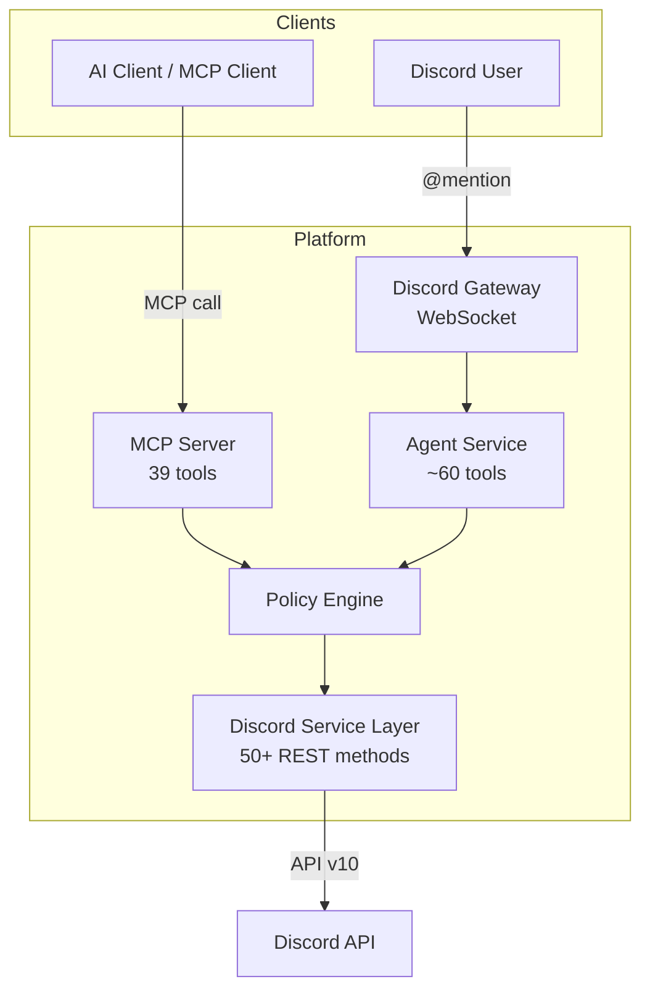
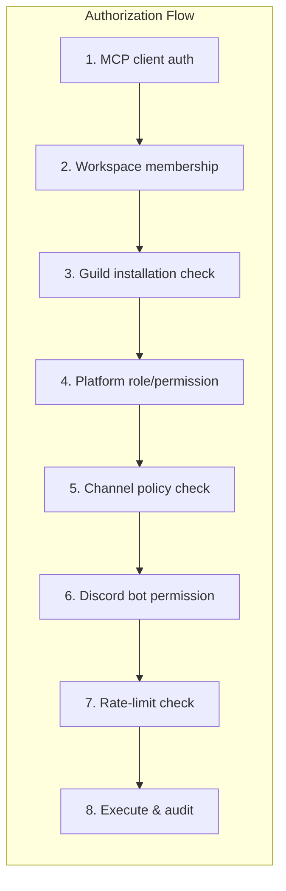
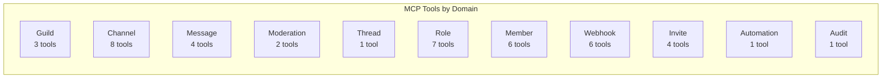
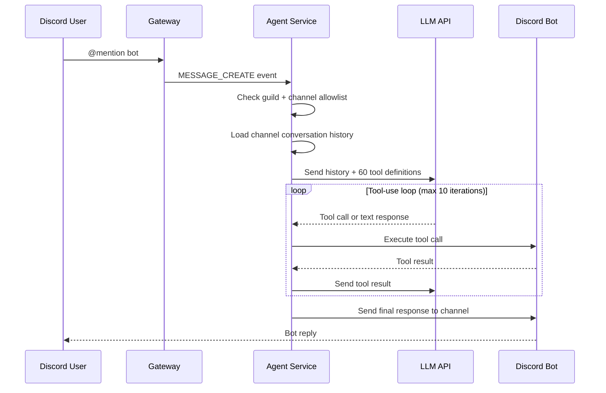
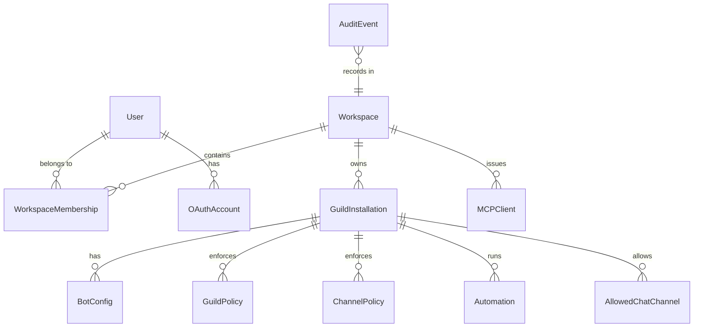

# Discord MCP Platform

A multi-server Discord control plane that exposes Discord operations as MCP tools, resources, and prompts for AI clients. Includes a built-in conversational AI agent that responds to Discord @mentions.

## What It Does

Users connect their Discord identity via OAuth2, install the platform bot into their servers, and then interact through MCP-compatible AI clients or by @mentioning the bot directly in Discord.

The platform translates natural language requests into safe, authorized Discord operations:

- "List my servers and channels"
- "Summarize the last 100 messages in #general"
- "Create a support channel and set permissions"
- "Create an automation that answers FAQs in #support"
- "Draft a moderation warning for this message"

## What This Is Not

This is not a self-bot. It does not use user tokens, control personal Discord accounts, scrape DMs, or bypass Discord permissions/rate limits. All operations execute through authorized bot accounts using official Discord APIs.

## Architecture





## Features

### MCP Server (39 tools)



| Domain | Tools |
|--------|-------|
| Guild | list, get, modify |
| Channel | list, get, create, edit, delete, edit/delete permissions |
| Message | list_recent, send, get, edit |
| Moderation | delete, bulk_delete |
| Thread | create |
| Role | list, create, modify, delete, reorder, assign, remove |
| Member | get, list, kick, ban, timeout, unban |
| Webhook | create, list, get, modify, delete, execute |
| Invite | create, list, get, delete |
| Automation | draft |
| Audit | list |

All state-changing tools support dry-run (default on). Risky operations require explicit confirmation. Every write is audited.

### Conversational Agent



- ~60 agent tools covering the full Discord API surface
- Per-channel conversation history
- Per-user cooldown
- Admin-controlled via `/allow-chat` and `/disallow-chat` slash commands

### Data Model



### Infrastructure

- Discord Gateway WebSocket with auto-reconnect
- Discord REST client with rate limit tracking and automatic retry
- Scope-based permission engine with guild/channel allowlists
- Audit logging with PII redaction
- 14 database models (PostgreSQL)
- Redis for caching and rate-limit coordination

## Quick Start

```bash
cp .env.example .env
# Edit .env with your Discord bot token and other settings
docker compose up --build
```

Health check:

```bash
curl http://localhost:8000/health
```

## Development

```bash
make install    # install dependencies
make dev        # run dev server with reload
make test       # run tests (no real Discord token needed)
make lint       # ruff check
make format     # ruff format
make typecheck  # mypy
make up         # docker compose up --build
make down       # docker compose down
```

## Environment Variables

Key variables (see `.env.example` for full list):

| Variable | Description |
|----------|-------------|
| `DISCORD_BOT_TOKEN` | Discord bot token |
| `DISCORD_CLIENT_ID` | Discord OAuth client ID |
| `DISCORD_CLIENT_SECRET` | Discord OAuth client secret |
| `DATABASE_URL` | PostgreSQL connection string |
| `REDIS_URL` | Redis connection string |
| `ALLOWED_GUILD_IDS` | Comma-separated guild allowlist (empty = all) |
| `MCP_TRANSPORT` | `http` or `stdio` |
| `ENABLE_GATEWAY` | Enable Discord Gateway WebSocket |
| `AGENT_ENABLED` | Enable conversational AI agent |
| `AGENT_API_KEY` | LLM API key for the agent |

## MCP Client Configuration

Local STDIO mode:

```json
{
  "mcpServers": {
    "discord": {
      "command": "uv",
      "args": ["run", "python", "-m", "discord_mcp_platform.mcp.server"],
      "env": {
        "DISCORD_BOT_TOKEN": "your-bot-token"
      }
    }
  }
}
```

HTTP mode: the MCP server is available at `http://localhost:8000/mcp` when `MCP_TRANSPORT=http`.

## Acknowledgements

Discord API types and endpoint coverage are based on the official [Discord OpenAPI specification](https://github.com/discord/discord-api-spec).

## Tech Stack

Python 3.12+ | FastAPI | MCP Python SDK | pydantic v2 | httpx | SQLAlchemy 2.x | PostgreSQL | Redis | Docker | pytest

## License

This project is licensed under the Apache License 2.0. See [LICENSE](./LICENSE) for details.

Copyright 2026 Luis Gustavo Vaz <me@rastrian.dev>
